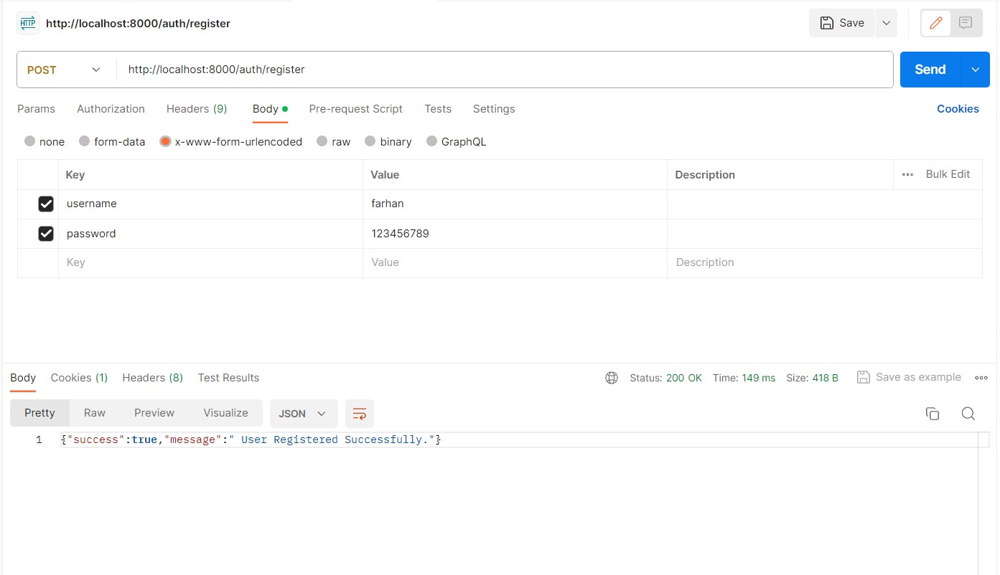
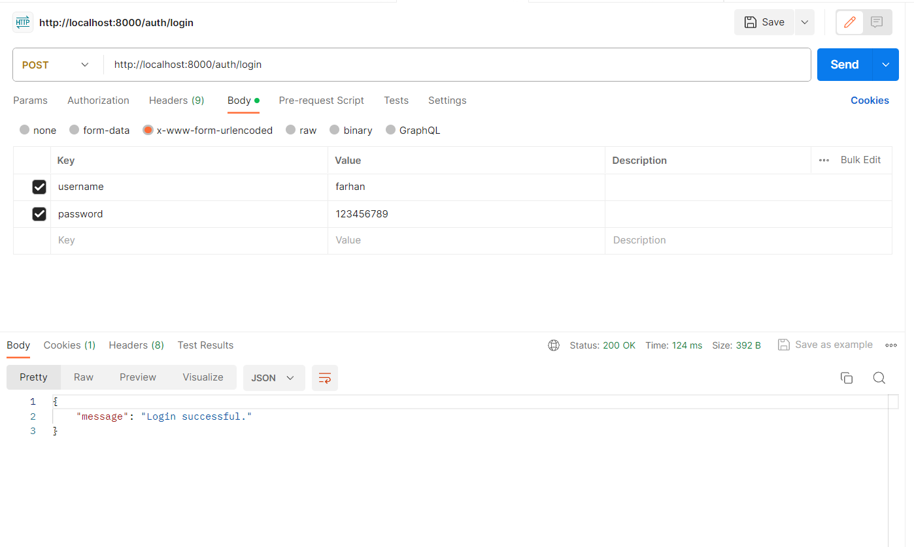
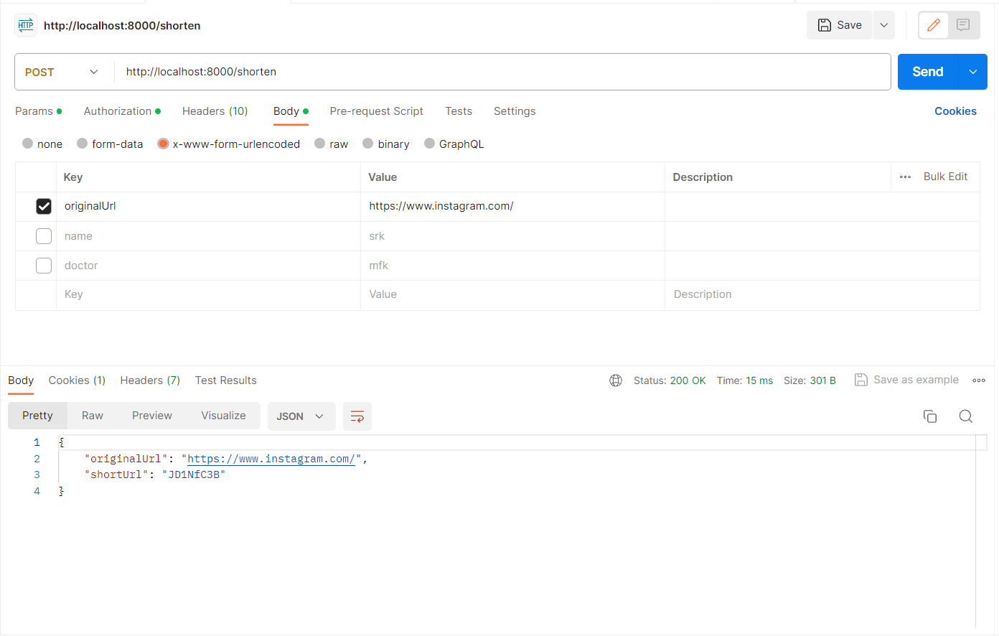
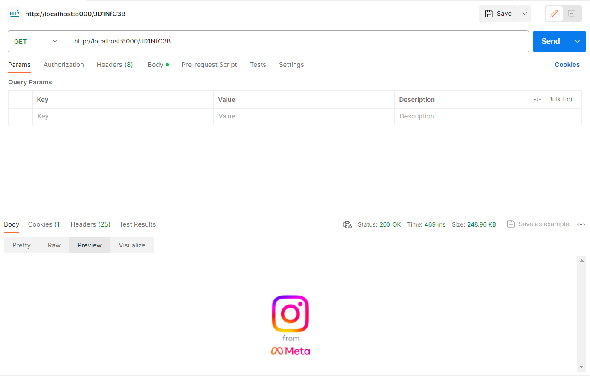
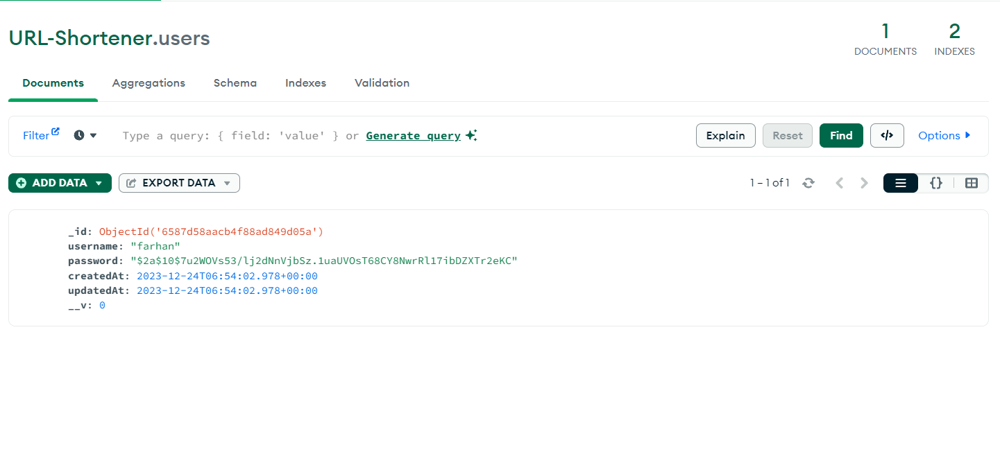
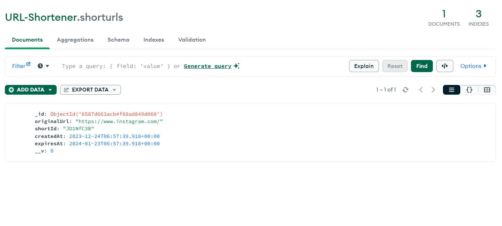

# URL Shortener
 

This API is used to shorten URL's .
It is built using NodeJs, ExpressJs, MongoDB and JavaScript.


## ⚙️ Functionality

- User Registration
- User Login
- URL Shortener

## 🧑‍💻 Getting started

- Fork the project
- Clone the forked repository in your local system
- In root directory index.js file you can edit the following:-
  - PORT="Your port number"
  - SESSION_SECRET_KEY="Your secret session key"
- Install all required packages

- In config directory mongoose.js file you can edit the following:-
- MONGODB_URL="Your MongoDB URL"

```bash
npm install
```

- Run project

```bash
npm start or nodemon index.js
```

The project is running on the port number provided by you.

## 🛠️ Tools Used

- NodeJS
- MongoDB
- ExpressJS
- JavaScript

### 📚 Libraries:

- bcryptjs
- connect-mongo
- express
- express-session
- mongoose
- passport
- passport-local


## 🖼️ Screenshots









